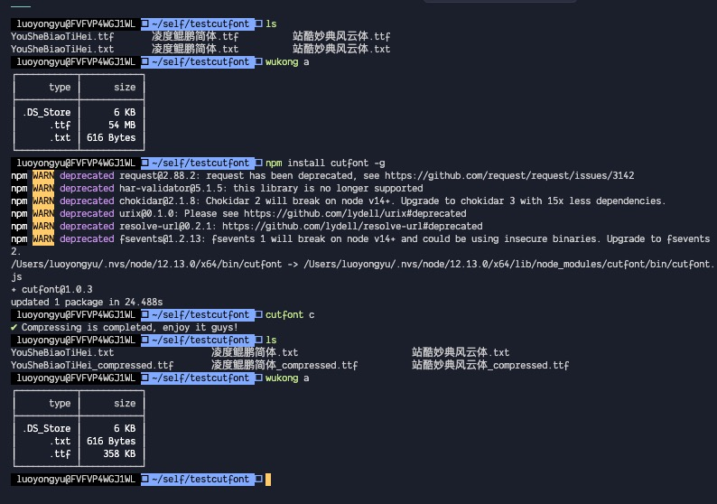

# 字体裁剪工具（cutfont）

字体裁剪工具，能根据您的目录.txt文件中所用的字符与字体未经压缩的字体包，生成您想要的字体包。



## 特点

1. 根据.txt文件和同一目录的.ttf字体包，生成裁剪的后的字体包 xxx_compressed.ttf

## 依赖

[字蛛](https://github.com/aui/font-spider)

## 安装（必须全局安装）

安装好 [nodejs](http://nodejs.org)，然后执行：

``` shell
npm install cutfont -g
```

## 使用范例

1. 命名：如您要压缩的字体为YouSheBiaoTiHei.ttf 那么需要在同一目录先新建YouSheBiaoTiHei.txt，并将你要保留的字符放在.txt文件中
2. 命令行：

``` shell
cutfont c
```

## 命令说明

  ### 生成默认的3500个常用汉字和半角 、全角特殊字符和英文还有数字的字体包。
  ``` shell
  cutfont d
  ```
  ### 根据您的.txt文件裁剪.ttf字体包。
  ``` shell
  cutfont c
  ```

## 注意：
- 目前只支持.ttf文件裁剪，想要更多issues见！