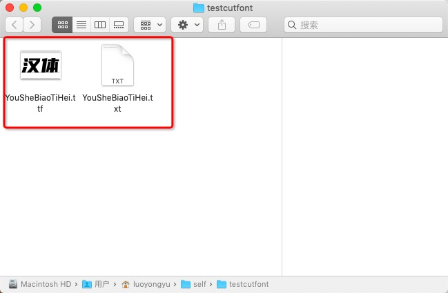

# 字体裁剪工具（cutfont）

压缩您的字体包，字体包只保留你想要的文字！

## 背景 

为了特定的显示效果，往往需要使用特定的字体包。但是中文字体包往往体积很大，可到30m。那我们把它裁剪压缩，体积变小，就能满足需求。


## 安装（必须全局安装）

安装好 [nodejs](http://nodejs.org)，然后执行：

``` shell
npm install cutfont -g
```


## 使用范例
1. 把您想要的字体写入.txt文件中
2. **.txt文件与您的字体包命名一致**


3. 执行命令：

``` shell
cutfont c
```

## 命令说明

  #### 生成默认的3500个常用汉字和半角 、全角特殊字符和英文还有数字的字体包。
  ``` shell
  cutfont d
  ```
  #### 根据您的.txt文件裁剪.ttf字体包。
  ``` shell
  cutfont c
  ```
## 鸣谢

[字蛛](https://github.com/aui/font-spider)

## 注意：
- 目前只支持.ttf文件裁剪，想要更多issues留言！